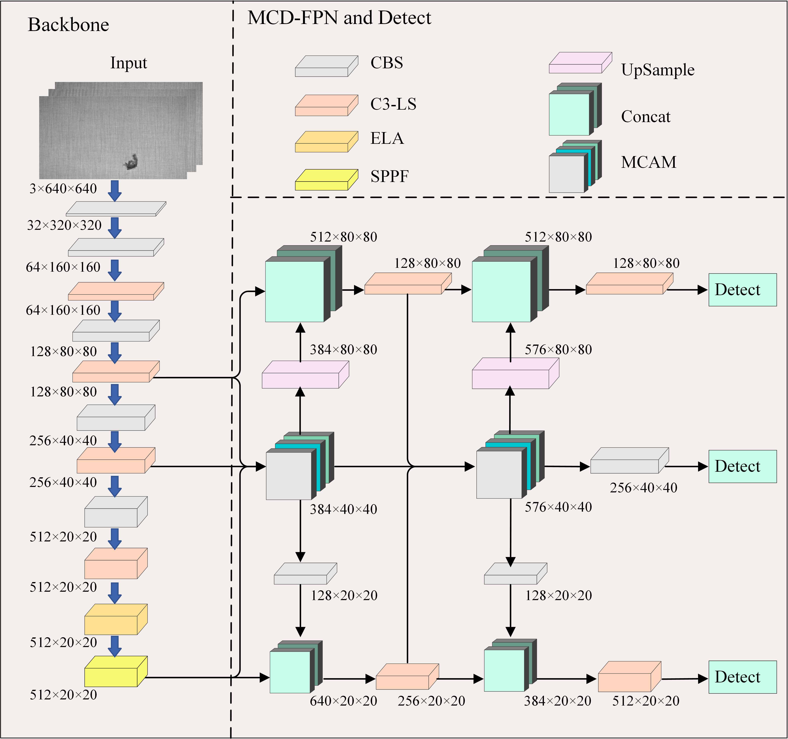
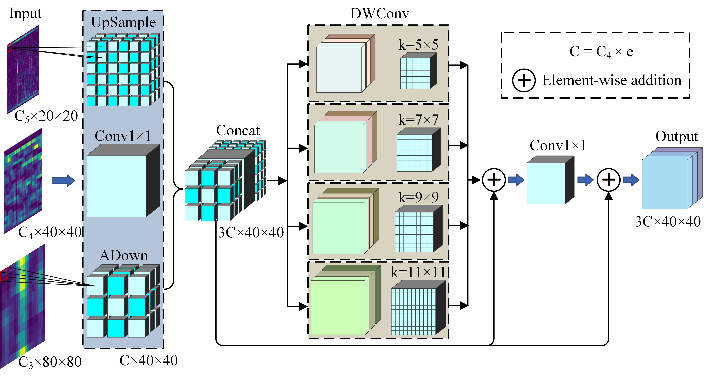
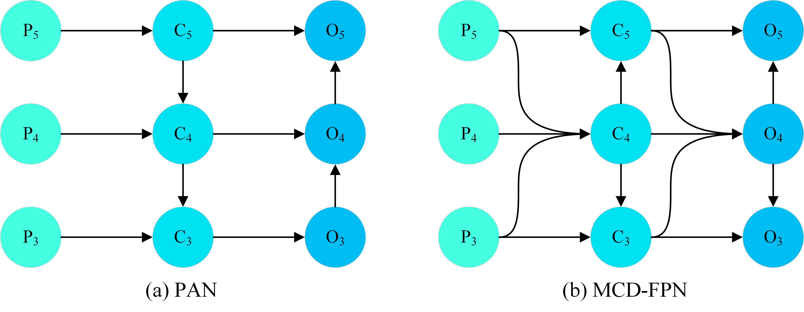
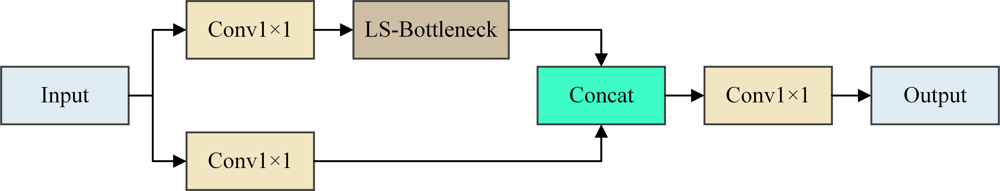
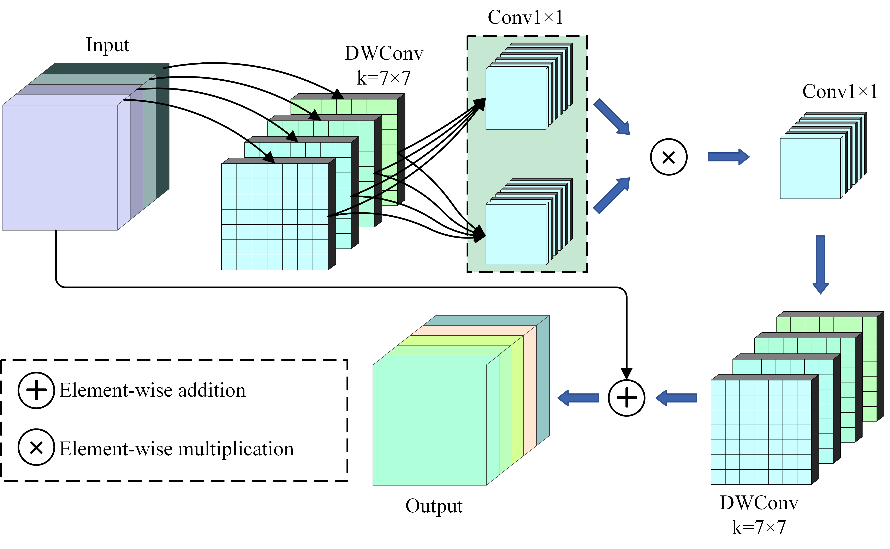

# Enhancing Multi-Scale Fabric Defect Detection with MCF-Net: A Context Fusion Approach ([The Visual Computer](https://link.springer.com/journal/371))

This repository is a PyTorch implementation of our paper: Enhancing Multi-Scale Fabric Defect Detection with MCF-Net: A Context Fusion Approach.

## The overall architecture of MCF-Net

The proposed MCF-Net framework is aligned with YOLOv5 and comprises three main components: the backbone, the neck, and the head. In the backbone, the C3-LS module is employed to enhance the model's feature extraction capability, while the ELA attention mechanism is incorporated before the SPPF module to enable the model to focus more effectively on feature representations within the target region. In the neck, the MCAM module captures the global contextual information of multi-scale features, and the MCD-FPN structure extends the outputs of MCAM to both low-level and high-level features, establishing long-range dependencies between defect features and their surrounding background across various detection scales. Finally, the features fused by the MCD-FPN are utilized for prediction in the head module.



## Multi-scale context aggregation module(MCAM)

This module takes multi-scale feature maps as input and effectively utilizes the strengths of each scale to capture global contextual information. Additionally, residual structures are incorporated to preserve and utilize the original feature information across multiple levels, thereby improving both the training efficiency and the detection performance of the model.

### The Addown module can be referenced as follows：
> **Wang, Chien-Yao; Yeh, I-Hau; Mark Liao, Hong-Yuan.** *Yolov9: Learning what you want to learn using programmable gradient information.* In: European Conference on Computer Vision, 2025, pages 1--21. Springer.



## Multi-scale context diffusion fusion pyramid network(MCD-FPN)
The MCD-FPN employs an early fusion strategy: it uses the MCAM module at the intermediate scale C_4 to first fuse multi-scale features, which are subsequently propagated to both shallow and deep layers. During this process, the shallow and deep features are interactively fused with the multi-scale features captured by the MCAM, effectively avoiding information loss or degradation during multilevel transmission.



## Feature extraction based on high-dimensional spatial mapping(C3-LS)
The module initiates by partitioning the original features into two parts along the channel dimension using two 1×1 convolutional layers. One part is passed through the LS-Bottleneck module for feature extraction, while the other part functions as a constant mapping that is subsequently fused with the output of the LS-Bottleneck. Finally, a 1×1 convolutional layer is applied to modulate the channel dimensions of the feature map and facilitate inter-channel information exchange.

### The C3-LS structure



### LS-Bottleneck




## Comprehensive comparison with other models on the FD6052 dataset
| Models            | Precision (%) | Recall (%) | mAP50 (%) | mAP95 (%) | Params (M) | GFLOPS |
|-------------------|---------------|------------|-----------|-----------|------------|--------|
| SSD-VGG16         | 92.9          | 29.8       | 73.7      | 31.5      | 24.3       | 61.3   |
| Faster RCNN-ResNet50 | 43.4       | 85.3       | 62.0      | 26.1      | 28.3       | 941.0  |
| YOLOv5n          | 87.1          | 77.5       | 85.7      | 44.2      | 1.8        | 4.2    |
| YOLOv5s          | 90.3          | 82.2       | 89.4      | 48.3      | 7.0        | 15.8   |
| YOLOv6n          | 61.7          | 56.1       | 60.0      | 27.5      | 4.6        | 11.3   |
| YOLOv6s          | 66.3          | 57.6       | 62.6      | 29.7      | 18.5       | 45.1   |
| YOLOX-n          | 87.2          | 81.5       | 83.4      | 45.5      | 2.2        | 6.9    |
| YOLOX-s          | 91.4          | 89.7       | 88.9      | 51.0      | 9.0        | 26.8   |
| YOLOv8n          | 62.3          | 58.9       | 64.1      | 36.5      | 3.0        | 8.1    |
| YOLOv8s          | 81.4          | 81.3       | 87.1      | 30.7      | 11.1       | 28.4   |
| YOLO11           | 86.3          | 84.1       | 90.2      | 44.1      | 2.6        | 6.3    |
| YOLO11           | 88.0          | 88.5       | 94.4      | 48.3      | 9.4        | 21.3   |
| IDD-YOLO         | 91.4          | 86.2       | 90.1      | 50.4      | 2.9        | 5.3    |
| LiteYOLO-ID      | 79.7          | 84.0       | 88.3      | 46.2      | 3.8        | 9.6    |
| Ours             | 94.1          | 90.2       | 95.1      | 55.5      | 8.5        | 20.6   |

## Comprehensive comparison with other models on the TianChi dataset
| Models               | Precision (%) | Recall (%) | mAP50 (%) | mAP95 (%) | Params (M) | GFLOPS |
|----------------------|---------------|------------|-----------|-----------|------------|--------|
| SSD-VGG16            | 71.7          | 26.4       | 43.0      | 22.2      | 24.3       | 61.3   |
| Faster RCNN-ResNet50 | 27.4          | 51.3       | 30.5      | 11.3      | 28.3       | 941.0  |
| YOLOv5n             | 67.6          | 57.8       | 58.3      | 30.7      | 1.8        | 4.2    |
| YOLOv5s             | 70.7          | 57.5       | 61.1      | 31.7      | 7.0        | 15.8   |
| YOLOv6n             | 61.5          | 54.4       | 56.0      | 32.5      | 4.6        | 11.3   |
| YOLOv6s             | 58.7          | 57.9       | 58.2      | 32.8      | 18.5       | 45.2   |
| YOLOX-s             | 58.5          | 36.6       | 35.7      | 18.3      | 9.0        | 26.8   |
| YOLOv8n             | 63.8          | 56.9       | 57.5      | 31.9      | 3.0        | 8.1    |
| YOLOv8s             | 73.8          | 56.4       | 61.4      | 35.1      | 11.1       | 28.4   |
| YOLO11n             | 65.5          | 54.5       | 57.3      | 32.1      | 2.6        | 6.3    |
| YOLO11s             | 67.6          | 56.1       | 59.2      | 33.6      | 9.4        | 21.3   |
| IDD-YOLO            | 72.4          | 56.9       | 60.2      | 32.8      | 2.9        | 5.3    |
| LiteYOLO-ID         | 68.3          | 59.4       | 59.8      | 32.2      | 3.8        | 9.6    |
| Ours                | 71.0          | 62.3       | 63.4      | 34.2      | 8.5        | 20.6   |

## Comprehensive comparison with other models on the DAGM2007 dataset
| Models               | Precision (%) | Recall (%) | mAP50 (%) | mAP95 (%) | Params (M) | GFLOPS |
|----------------------|---------------|------------|-----------|-----------|------------|--------|
| SSD-VGG16            | 87.3          | 86.2       | 89.6      | 53.2      | 24.3       | 61.3   |
| Faster RCNN-ResNet50 | 86.1          | 73.5       | 79.3      | 52.2      | 28.3       | 941.0  |
| YOLOv5n             | 96.1          | 98.9       | 98.6      | 62.0      | 1.8        | 4.2    |
| YOLOv5s             | 98.2          | 99.1       | 98.7      | 63.9      | 7.0        | 15.8   |
| YOLOv6n             | 96.1          | 96.9       | 97.7      | 60.4      | 4.7        | 11.4   |
| YOLOv6s             | 96.6          | 98.2       | 98.1      | 62.3      | 18.5       | 45.1   |
| YOLOX-s             | 92.7          | 94.6       | 92.0      | 58.6      | 9.0        | 26.8   |
| YOLOv8s             | 95.3          | 97.6       | 98.3      | 65.7      | 11.1       | 28.5   |
| YOLO11s             | 97.5          | 98.0       | 98.7      | 65.8      | 9.4        | 21.3   |
| HookNet              | 99.4          | 93.8       | 98.6      | -         | 4.4        | -      |
| IDD-YOLO            | 96.8          | 98.9       | 98.8      | 62.5      | 2.9        | 5.3    |
| LiteYOLO-ID         | 96.4          | 98.6       | 98.7      | 62.5      | 3.8        | 9.6    |
| Ours                | 98.1          | 99.1       | 98.9      | 65.0      | 8.5        | 20.6   |

## Ablation experiments for modules on the FD6052 dataset
| YOLOv5s | ELA | MCD-FPN (MCAM) | C3-LS | Precision (%) | Recall (%) | mAP50 (%) |
|----------|-----|----------------|-------|---------------|------------|-----------|
| √        |     |                |       | 90.5          | 82.2       | 89.6      |
| √        | √   |                |       | 88.9          | 84.7       | 90.2      |
| √        |     | √              |       | 92.8          | 87.4       | 92.3      |
| √        |     |                | √     | 94.0          | 88.7       | 93.7      |
| √        | √   |                | √     | 93.0          | 89.2       | 93.5      |
| √        | √   | √              |       | 92.3          | 89.0       | 94.2      |
| √        |     | √              | √     | 93.3          | 89.1       | 95.0      |
| √        | √   | √              | √     | 94.1          | 90.2       | 95.1      |

## Comparison of different pruning methods, where "None" indicates no channel pruning
| Module              | Method     | Speed_up | mAP50 (%) | mAP95 (%) | Params (M) | GFLOPS |
|---------------------|------------|----------|-----------|-----------|------------|--------|
| YOLOv5s             | None       | None     | 89.4      | 48.3      | 7.0        | 15.8   |
| MCF-Net (Ours)      | None       | None     | 95.1      | 55.5      | 8.5        | 20.6   |
| MCF-Net-Prune1      | LAMP       | 2.0      | 94.4      | 55.3      | 4.1        | 10.1   |
| MCF-Net-Prune2      | LAMP-G     | 2.0      | 94.7      | 54.7      | 3.8        | 10.1   |
| MCF-Net-Prune3      | Group_Norm | 2.0      | 94.3      | 55.2      | 4.1        | 10.1   |
| MCF-Net-Prune4      | LAMP       | 2.5      | 67.0      | 36.2      | 3.3        | 8.1    |


<details open>
<summary>Install</summary>

Clone repo and install [requirements.txt](https://github.com/ultralytics/yolov5/blob/master/requirements.txt) in a
[**Python>=3.7.0**](https://www.python.org/) environment, including
[**PyTorch>=1.7**](https://pytorch.org/get-started/locally/).
  
```bash
git clone https://github.com/wyyt1202/MCF-Net  # clone
cd MCF-Net
pip install -r requirements.txt  # install
```
</details>

## 
```
python val.py --weights MCF-Net.pt --data ../datasets/fabric.yaml --img 640  # validate
```

<details open>
<summary>Train</summary>

### Single-GPU
`python train.py --model MCF-Net.yaml --epochs 5 --img 640 --batch 32 --data ../datasets/fabric.yaml`

### Multi-GPU DDP
`python -m torch.distributed.run --nproc_per_node 4 --master_port 1 train.py --model MCF-Net.yaml --epochs 5 --img 640 --device 0,1,2,3 --data ../datasets/fabric.yaml`
</details>

<details>
<summary>Val with val.py</summary>

`val.py` runs on a validation set and saving results to `runs/val`.
```
python val.py --weights MCF-Net.pt --img 640 --batch 32 --data ../datasets/fabric.yaml
```
</details>

<details>
<summary>Inference with detect.py</summary>

`detect.py` runs inference on a variety of sources and saving results to `runs/detect`.
```
python detect.py --source 0  # webcam
                          img.jpg  # image
                          vid.mp4  # video
                          screen  # screenshot
                          path/  # directory
                          'path/*.jpg'  # glob
                          'https://youtu.be/Zgi9g1ksQHc'  # YouTube
                          'rtsp://example.com/media.mp4'  # RTSP, RTMP, HTTP stream
```
</details>

